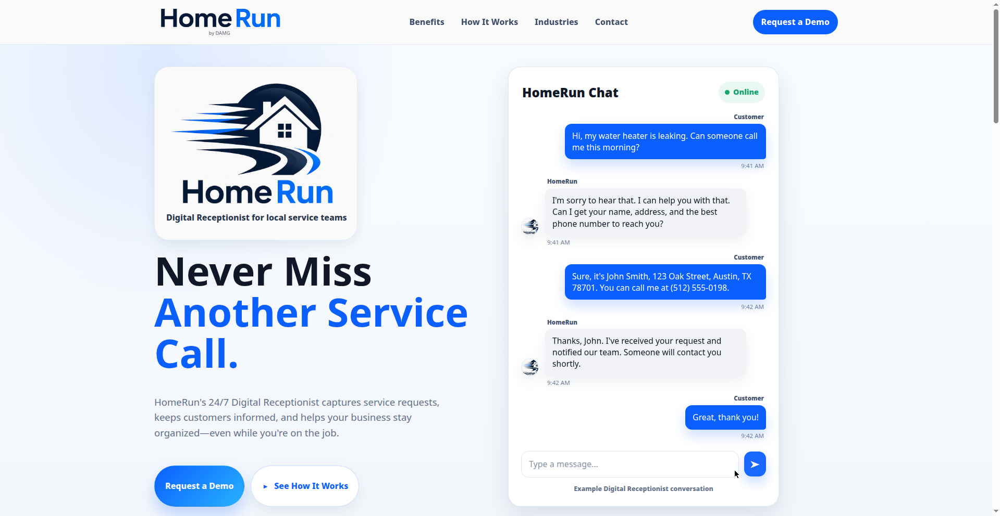
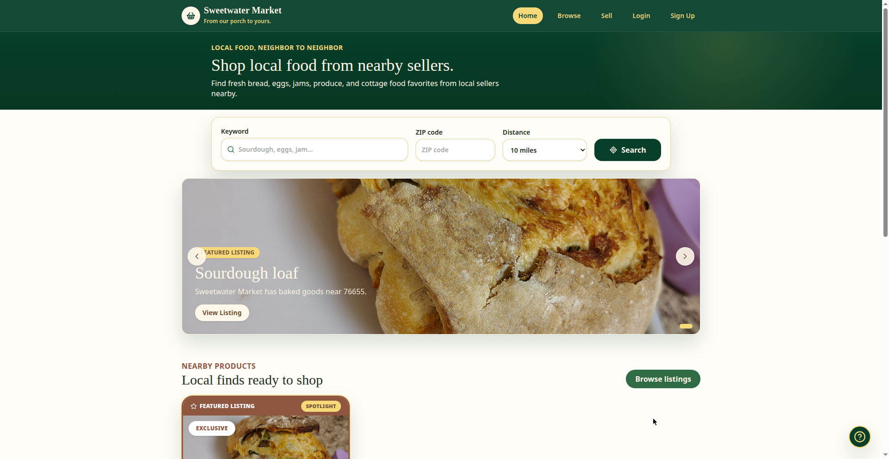

# Hi, I'm Laura Bartlett 👋

Co-founder of **Digital Architecture Management Group** — I build websites and AI tools for home service businesses in Central Texas and beyond.

## What I build

### 🤖 [HomeRun](https://homerun.work)
AI chat widget for home service businesses. Answers questions 24/7, takes service requests, sends instant alerts.

### 🛒 [Sweetwater Market](https://sweetwatermarket.shop)
Online marketplace for homemade and homegrown goods.

### 🌐 [Custom websites & business systems](https://digitalarchitecturemanagementgroup.com)
Full-service website design, web apps, and AI automation for small businesses.

## My stack

Next.js · TypeScript · Python · Supabase · Stripe · n8n · OpenClaw · Docker · Cloudflare · Resend

## Work with me

I'm open to freelance web development and AI automation projects.

📧 [admin@homerun.work](mailto:admin@homerun.work)
